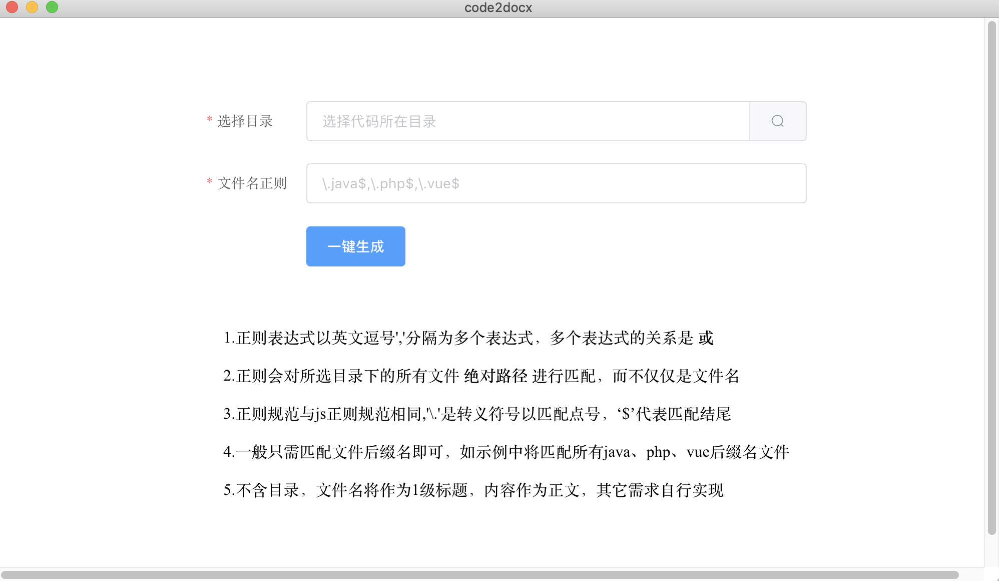

# code2docx

> what is this

递归目录下指定文件，插入内容到 docx 中

其中相对路径文件名作为标题 1，内容作文正文

<br>

> An electron-vue project

国内网络请注意设置 electron 镜像：

```bash
yarn config set electron_mirror https://npm.taobao.org/mirrors/electron/
yarn config set electron_custom_dir "{{ version }}"
```

electron-vue 存在 nodejs 兼容问题，暂不修复，请使用版本:

```
nvm use 11.15.0
```

#### Build Setup

```bash
# install dependencies
yarn install

# serve with hot reload at localhost:9080
yarn dev

# build electron application for production
yarn build


```

---

This project was generated with [electron-vue](https://github.com/SimulatedGREG/electron-vue) using [vue-cli](https://github.com/vuejs/vue-cli). Documentation about the original structure can be found [here](https://simulatedgreg.gitbooks.io/electron-vue/content/index.html).
